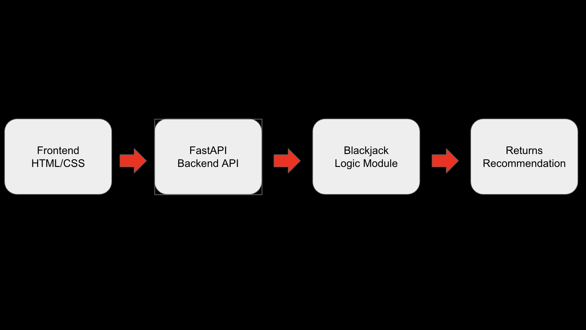

# Blackjack Advisor


**1) Executive Summary**
**Problem:** Casual blackjack players often make suboptimal decisions, increasing the house edge and their potential losses. Memorizing strategy charts can be difficult for beginners.
**Solution:** The Blackjack Advisor is a containerized web application that provides instant, mathematically optimal move recommendations (Hit, Stand, Double, Split) based on the player's hand and the dealer's upcard. It features a simple web interface and a REST API for easy integration.

**2) System Overview**
**Course Concept(s):** **FastAPI & Docker**. The project demonstrates building a high-performance REST API using FastAPI and packaging it into a reproducible container using Docker.
**Architecture Diagram:**

*(Note: Please ensure an architecture diagram exists at `assets/architecture.png` or similar)*
**Data/Models/Services:**
*   **Logic:** Pure Python implementation of Blackjack Basic Strategy (no external ML models).
*   **API:** FastAPI (Python).
*   **Frontend:** HTML/JS (Static).
*   **License:** MIT License.

**3) How to Run (Local)**
**Docker**
```bash
# Build the image
docker build -t blackjack-advisor .

# Run the container (Frontend at http://localhost:8080)
docker run --rm -p 8080:8000 blackjack-advisor
```

**Test the API manually:**
```bash
curl -X POST http://localhost:8080/advise \
  -H "Content-Type: application/json" \
  -d '{"player":["A","7"], "dealer":"9"}'
```

**Health Check (Ops):**
```bash
curl http://localhost:8080/health
# Output: {"status": "healthy", "service": "blackjack-advisor"}
```

**4) Design Decisions**
**Why this concept?** Blackjack strategy is a perfect candidate for a microservice: it has clear inputs, deterministic outputs, and benefits from a clean API interface.
**Alternatives considered:**
*   *Flask:* Considered, but FastAPI was chosen for its automatic data validation (Pydantic) and built-in Swagger UI documentation.
*   *Machine Learning:* A trained model could learn strategy, but Basic Strategy is a solved mathematical problem, so a deterministic algorithm is more accurate and efficient.
**Tradeoffs:**
*   *Simplicity vs. Features:* The app focuses on the core "Basic Strategy" without card counting or betting systems to keep the scope manageable and the codebase clean.
**Security/Privacy:**
*   No user data is stored.
*   Input validation prevents malformed requests from crashing the server.
**Ops:**
*   **CI/CD:** A GitHub Actions workflow (`.github/workflows/ci.yml`) automatically runs tests and builds the Docker image on every push.
*   **Observability:** The application logs all requests and strategy decisions to stdout, which can be captured by Docker logging drivers. A `/health` endpoint is provided for orchestration health checks.
*   The container is stateless, allowing for easy horizontal scaling if needed.

**5) Results & Evaluation**
**Sample Output:**
Input: Player [10, 6], Dealer [10] -> Output: `{"action": "Hit"}`
Input: Player [10, 7], Dealer [6] -> Output: `{"action": "Stand"}`

**Performance:**
The API response time is negligible (<10ms) as the logic is purely computational O(1).
**Validation:**
Unit tests in `tests/` verify the strategy against known correct moves.

**6) What’s Next**
*   Add support for specific table rules (e.g., "Dealer hits soft 17").
*   Implement a "Card Counting" drill mode.
*   Deploy to a cloud provider (e.g., AWS App Runner or Google Cloud Run).
*   **Deploy to Render:**
    1.  Fork/Push this repo to your GitHub.
    2.  Sign up for [Render](https://render.com).
    3.  Click "New +", select "Web Service", and connect your repo.
    4.  Render will automatically detect `render.yaml` and deploy!

**7) Links**
*   **GitHub Repo:** [https://github.com/ZachEklund/final-project-docker](https://github.com/ZachEklund/final-project-docker)